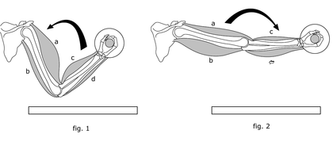
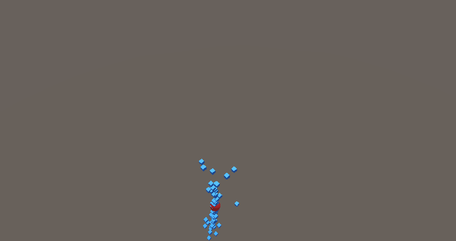
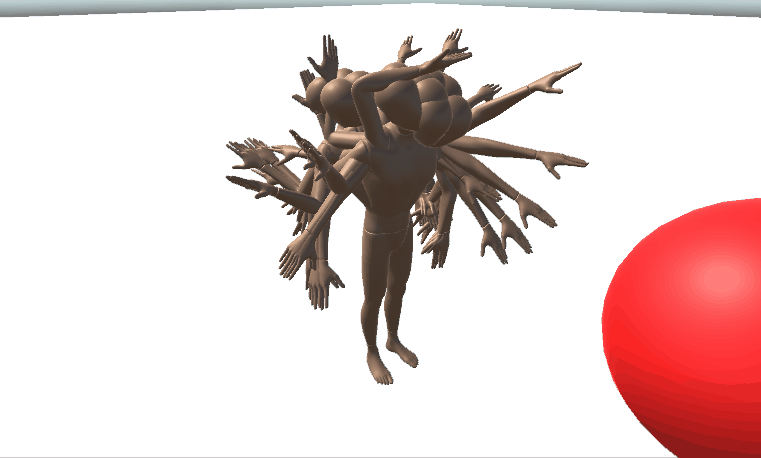

# Born to walk - **Unity/C#**
### ISART DIGITAL GP3, School Project: *Benjamin MARIN, Rémi GINER*  
<br>

<div style="text-align:center">


</div>

<!-- ABOUT THE PROJECT -->
# About The Project 
**Built with Unity 2021.3.5f1**

The goal of this project is to apply the principles of learning in a video game contexte. We decided to take on the challenge of developing an AI capable of learning to walk using a *ragdoll* as a physical representation. This AI works on a multilayer perceptron basis refined by genetic algorithms.

# Table of contents
1. [Features](#features)
1. [Controls](#controls)
2. [Details](#details)
    - [Ragdoll Implementation](#ragdoll-implementation)
    - [Genetic Algorithm Implementation](#genetic-algorithm-implementation)
3. [In the future](#itf)
4. [References](#references)
5. [Versionning](#versionning)
6. [Autors](#authors)


# Features
- Genetic simulation that works with any type of Physical Controller
- Multilayer perceptron algorithms
- MLP and genetic population serialization
- Basic training for a ragdoll to stand up

# Controls
There is no character controller, to navigate in the scene you have to use the scene viewer no clip mode.
- To change the current scene you have to use the Unity Content Browser.
- To Save or Load you can use the UI.

# Details

## Genetic Algorithm Implementation
We decided to implement a genetic algorithm to teach a ragdoll to walk by natural selection.

To integrate a genetic algorithm with Multilayer Perceptrons in the project, 
we instantiate a population with variable neural network weights.
At each fixed update, we send a list of inputs to the MLP and obtain the list of outputs.

```cs
private void FixedUpdate()
    {
        List<float> inputs = mlpInterpreter.GetInputs();
        List<float> outputs = mlp.FeedForward(inputs);   
        mlpInterpreter.SetOuputs(outputs); 
    }
```

When the limits of the fixed frame are reached, a new generation is created.

When the new generation is created, the algorithm calculates all the fitnesses of the population,
The fitness is based on some criteria, for example the distance traveled.
When all the fitnesses are calculated, we get the sum of them.
And a sorting on the population is done according to the best fitness.
After that, the elite of the population is selected, the number of elite is configurable.

The rest of the new generation is instantiated by doing a crossover between two elites (parents).
The crossover mixes the weight of the neurons of the chosen parent, the weight of the neurons is chosen at 50% between the two parents.
```cs
public static void Crossover(ref GeneticModifier child, in GeneticModifier parentA, in GeneticModifier parentB)
{
    for (int hli = 0; hli < child.mlp.hiddenLayers.Count; hli++)
    {
        Layer childHiddenLayer = child.mlp.hiddenLayers[hli];

        Layer hiddenLayerA = parentA.mlp.hiddenLayers[hli];
        Layer hiddenLayerB = parentB.mlp.hiddenLayers[hli];

        for (int hpi = 0; hpi < childHiddenLayer.perceptrons.Count; hpi++)
        {
            bool chooseParentA = Random.Range(0.0f, 1.0f) < 0.5f;
            hildHiddenLayer.perceptrons[hpi] = new Perceptron((chooseParentA ? hiddenLayerA : hiddenLayerB).perceptrons[hpi]);
        }
    }

    Layer outputLayerA = parentA.mlp.outputLayer;
    Layer outputLayerB = parentB.mlp.outputLayer;

    for (int hpi = 0; hpi < outputLayerA.perceptrons.Count; hpi++)
    {
        bool chooseParentA = Random.Range(0.0f, 1.0f) < 0.5f;
        child.mlp.outputLayer.perceptrons[hpi] = new Perceptron((chooseParentA ? outputLayerA : outputLayerB).perceptrons[hpi]);
    }
}
```

When the crossover is completed, a mutation of this new child is performed according to a mutation rate.
Each neuron weight has a chance to mutate according to the mutation rate, if a neuron is mutated a weight between -0.1 and 0.1 is added.

```cs
public void Mutate(float mutationRate)
{
    foreach (Layer hiddenLayer in mlp.hiddenLayers)
    {
        foreach (Perceptron hiddenPerceptron in hiddenLayer.perceptrons)
        {
            if (Random.Range(0.0f, 1.0f) < mutationRate)
                hiddenPerceptron.Mutate();
        }
    }

    foreach (Perceptron outputPerceptron in mlp.outputLayer.perceptrons)
    {
        if (Random.Range(0.0f, 1.0f) < mutationRate)
            outputPerceptron.Mutate();
    }
}
```
The old population is destroyed and the new generation repeats the process.

## Ragdoll implementation
To integrate ragdoll physics into the project, we had to make that the MLP outputs supported by Unity's native ragdoll system. To do this, we had to research a bit how muscle joints work for a humanoid entity. After a bit of thought, we discovered that the only outputs our AI needed to give were different torque (scalar) values for each of the bones in the ragdoll.

<div style="text-align:center">



*Muscular flexion scheme*
</div>


### **Character Joint Implementation**
By using the variables ``axis`` and ``wingAxis``, we were able to obtain a correct behavior of the joints. Using only 2 scalars allows us to better mimic the behavior of humanoid joints and limit the number of outputs. With 10 bones, we had 20 outputs in total.

```cs
    for (int i = 0; i < bones.Count - 1; ++i)
    {
        Bone currentBone = bones[i];

        float torque = outputs[i];
        float swingTorque =  outputs[i * 2];

        // axis: "The Direction of the axis around which the body is constrained."
        // swingAxis: "The secondary axis around which the joint can rotate."

        currentBon.rigidbody.AddRelativeTorque(torque * force * currentBon.characterJoint.axis, ForceMode.Impulse);
        currentBon.rigidbody.AddRelativeTorque(swingTorque * force * currentBon.characterJoint.swingAxis, ForceMode.Impulse);
    }
```

### **Collision Query and Ignore Collisions**
To see our population evolve properly, we had to instantiate each individual in the same position to check for evolution. Because of the dynamic instantiation, and because collisions between the bones of a ragdoll are very important, we had to ignore layers with other ragdolls on the fly. To do this, we had to ignore collisions between 26 of the 31 layers (because the first 5 layers are native to Unity) at the beginning of the program. Then, after creating our entire population, we had to recursively define the layers for each bone in each individual.

```cs
if (useLayerIgnore)
{
    for (int lai = layerOffset; lai < populationCount + layerOffset; lai++)
    {
        for (int lbi = lai + 1; lbi < populationCount + layerOffset; lbi++)
            Physics.IgnoreLayerCollision(lai, lbi, true);
    }

    SetLayers();
}

private void SetLayers()
{
    for (int i = 0; i < populationCount; i++)
        population[i].gameObject.SetLayerRecursively(layerOffset + i);
}

public static void SetLayerRecursively(this GameObject obj, int newLayer)
{
    obj.layer = newLayer;

    for (int i = 0; i < obj.transform.childCount; i++)
        obj.transform.GetChild(i).gameObject.SetLayerRecursively(newLayer);
}
```

<div style="text-align:center">


*Ragdoll training with collisions*
</div>

<div style="text-align:center">


*Ragdoll training without collisions*
</div>

## Stages of development

### **Algorithm development**
When we started the project, we took as an ambitious goal to train an AI to walk. We knew it wasn't going to be possible in a week, but we took the challenge. We first started to develop the interface for the MLP to interact with the Ragdoll. Then we implemented the genetic algorithms using the MLP.

<div style="text-align:center">



*ML-Agents training where the cubes (in blue) must reach their goal (in red).*
</div>

<div style="text-align:center">


*Super trained ML-Agent cubes.*
</div>

After developing a solid genetic algorithm, we decided to be less ambitious and to first train ragdolls able to raise an arm in a direction. And this was a succes.

<div style="text-align:center">



*Short training to teach AIs to lift their arm towards their goal.*
</div>

<div style="text-align:center">


*Long training to teach AIs to lift their arm towards their goal*
</div>

Once that was done, we tried to get our AIs to work, but to no avail. They were orienting towards their goal and trying to go as far as possible, without using their legs.

<div style="text-align:center">


*AIs trying randoms moves to reach their goal*
</div>

<div style="text-align:center">


*AIs trying to stand as high as possible and move towards their goal*

</div>

After this second disappointment we tried to teach the AIs to use their legs, so we changed the setup and it was also a success.

<div style="text-align:center">


*AIs trying to stand as high as possible*

</div>

<div style="text-align:center">


*AIs trying to maintain their balance*

</div>

<div style="text-align:center">


*AIs managing to maintain their balance*

</div>

### **Fitness development**
In order for the AI to learn to have the highest possible head, we had to find a formula to obtain a fitness between $[0; 1]$. This value must be as high as possible when the head is close to its goal than when it is far from it. At first we just tried to use a simple formula, such as: $\dfrac{1}{d}$. Where $d$ is equals to ${dist(head, goal)}$

But this one was a problem because it was located between $]0,\infty[$. But thanks to function analysis we could find this formula: $\dfrac{1}{e^d} = e^{-d}$.

But this formula had a problem, its evolution was too low, the difference in fitness was not important enough for two very different head heights. So we ended up with this formula, more modular: $1 - \dfrac{d}{maxDistance}$. Where $maxDistance$ is an arbitrary value chosen according to the size of the set.

## In the future:
In the future, we will try to strengthen the learning process by creating our own ragdolls to make them more accurate. Also, we will try to train them on our own game engine to have more accurate physics and faster algorithms using C++.


## References:
General references:
- https://www.youtube.com/watch?v=gn4nRCC9TwQ

Genetic algorithm:
- https://www.section.io/engineering-education/the-basics-of-genetic-algorithms-in-ml/

Reinforcement learning:
- https://arxiv.org/pdf/2205.01906v2.pdf
- https://en.wikipedia.org/wiki/Q-learning

## Versionning
Git Lab for the versioning.

# Authors
* **Benjamin MARIN**
* **Rémi GINER**